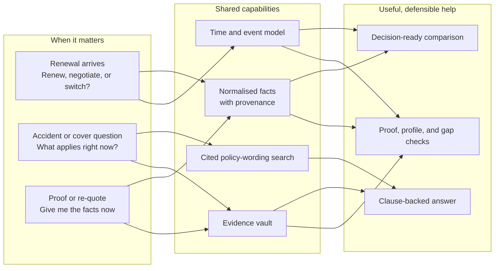
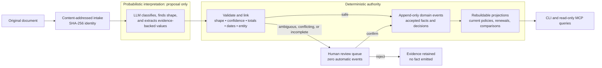

# Personal Records

Personal Records is for the moments when paperwork suddenly matters: a renewal
looks expensive, an accident happens, someone asks for proof of cover, or a
comparison site needs facts scattered across years of documents.

It is a local-first case study in building AI systems around unstructured
evidence. An LLM can interpret a document or question, but it only proposes
facts. Deterministic code decides what is safe to accept, and every accepted
answer leads back to the evidence that supports it.

> AI proposes. The system verifies. A human resolves uncertainty.

This repository is useful if you are exploring how to combine probabilistic AI
with conventional software without making the model the database, calculator, or
authority over durable state.

## The problem starts with a moment, not a document

People do not hire this system to ingest a PDF. They hire it to make a decision,
retrieve proof, or avoid an uninsured gap. The same small set of trusted
capabilities supports those different moments.



The complete job map is in [the jobs-to-be-done guide](docs/jobs-to-be-done.md). It deliberately includes
high-stakes needs—such as an accident or an insurer dispute—so the design is
judged by more than a happy-path document import.

## Why this project exists

The motivating failure was not a hallucination or malformed JSON.

A motor-and-home renewal invitation was interpreted as a single motor quote. The
bundle total was placed in the motor premium field with high confidence and
correct provenance, producing a false 62.7% renewal increase. The output was
schema-valid but did not represent reality.

The fix was not a better prompt alone. The domain model and validation boundary
had to change:

- a document can describe one or more product lines;
- a bundle total is separate from each line's premium;
- document shape is checked before facts are accepted;
- proposed and already-accepted renewals are different events;
- ambiguous documents emit no facts automatically.

The synthetic MultiCover example in this repository preserves that failure as a
regression test.

## What is implemented

The current build provides a runnable CLI and a read-only MCP server:

- PDF and text ingestion into a content-addressed local document store;
- LLM-backed document classification, shape recognition, and extraction;
- field-level confidence, source snippets, and page provenance;
- deterministic shape, confidence, total, premium-band, conflict, and linking
  checks;
- a human-review queue for unsafe or incomplete proposals;
- typed domain events and rebuildable projections;
- current-policy, renewal, quote-comparison, missing-information, and provenance
  queries;
- bounded policy-wording retrieval with exact clause citations;
- synthetic offline tests and a separate live-model evaluation set;
- seven structured, read-only MCP tools for use by a local AI assistant.

This is an engineering case study and usable local CLI, not a finished consumer
product. It has no GUI, passive email or cloud-drive ingestion, notification
service, or assistant-driven write access.

The proposed Attention Layer, Capability Register, Playbooks, and bounded agent
case loop are design extensions, not functionality in the current build. See
[the design guide](docs/design.md) for the architecture and authority model.

## How responsibilities are divided

| The model does | Deterministic code does |
|---|---|
| Classify an unstructured document | Enforce the registered document schema |
| Identify document shape | Reject unsafe or ambiguous shapes |
| Propose field values | Check confidence, totals, dates, and conflicts |
| Provide source snippets | Preserve evidence identity and provenance |
| Interpret a user's question | Calculate premiums and rebuild projections |
| Explain retrieved wording clauses | Select, bound, and cite the retrieved evidence |

The model never appends events, edits projections, performs premium arithmetic,
or decides silently that one policy replaces another.



The line between proposal and authority is the essential technical boundary:
the model can help make sense of messy evidence, but it has no direct path to
durable state.

## Try the core journey

Requirements:

- Python 3.11 or newer;
- an Anthropic API key supplied by you.

Run these commands from the repository root. All included documents are
synthetic. The temporary data directory keeps the exercise separate from any
normal local records.

```bash
python3 -m venv .venv
source .venv/bin/activate
pip install -e .

export ANTHROPIC_API_KEY=sk-ant-...
export PERSONAL_RECORDS_HOME="$(mktemp -d)"
```

### 1. File a policy from evidence

```bash
records ingest examples/motor_policy_schedule.txt
records policies
```

The schedule should be accepted as a policy record. The projection shows the
provider, policy dates, £352.40 annual premium, trust level, and a shortened
evidence ID.

### 2. Compare a renewal quote

```bash
records ingest examples/motor_renewal_quote.txt
records renewals
records ask "how does this quote compare to my current policy?"
```

The model selects the relevant query intent. Deterministic code pairs the quote
with the current policy and calculates the change from £352.40 to £378.90. The
answer carries both supporting document IDs.

### 3. See the system refuse a dangerous interpretation

```bash
records ingest examples/multicover_renewal_invitation.txt
records review
```

The MultiCover document contains motor and home lines and describes an already
accepted renewal. It is representable, but it is not safe to treat as a future
single-policy quote. The pipeline reports the structural reasons, emits zero
events automatically, and leaves the evidence in the review queue.

That refusal is the central demo: confidence and provenance are valuable, but
neither replaces domain-shape validation.

### 4. Retrieve policy wording with citations

```bash
records ingest examples/motor_policy_wording.txt
records ask "am I covered for a cracked windscreen?"
```

Policy wording is chunked and indexed locally. An answer is allowed only when it
is supported by retrieved clause text and valid citation metadata. An unrelated
question, such as one about jetski mooring damage, fails closed when no relevant
clause is found.

## Command reference

```text
records ingest FILE                  Classify, extract, validate and route a PDF or text file
records review                       List work awaiting a decision
records review --confirm DOC_ID      Accept one reviewed extraction explicitly
records review --reject DOC_ID       Reject proposed facts but retain the evidence
records policies                     Show current filed policies
records renewals                     Show the renewal calendar
records ask "QUESTION"               Query records and include evidence IDs
records discard DOC_ID --reason ...  Retract one document's facts without deleting history
records eval                         Run the live-model synthetic evaluation set
records mcp                          Start the read-only MCP server over stdio
records --help                       Show commands and data/key requirements
```

`ingest`, `ask`, and `eval` call Anthropic and require
`ANTHROPIC_API_KEY`. Review, projection, discard, and MCP commands operate on
local state without calling the extraction model.

By default, data is stored under `~/.personal-records/`. Set
`PERSONAL_RECORDS_HOME` to use a separate directory.

## Connect a local AI assistant

`records mcp` starts a read-only MCP server over stdio. It does not require an
Anthropic API key because the hosting assistant supplies its own model.

The exact tool set is:

- `list_records`
- `get_record`
- `get_renewals`
- `compare_quotes`
- `find_missing_info`
- `get_provenance`
- `search_policy_wording`

The server exposes structured projections and allowlisted provenance. It does not
expose raw documents, local storage paths, ingestion, review decisions,
retractions, event append, or generic record updates. Policy-wording search
returns clause evidence rather than a coverage verdict.

See [docs/mcp.md](docs/mcp.md) for configuration, response contracts, and a
verification journey.

## Local-first and privacy boundaries

- Original documents and derived state stay in the configured local data
  directory.
- Document text is sent to Anthropic only when classification, extraction, or
  interpretation requires it.
- The MCP read path makes no extraction-model call.
- Raw personal documents, credentials, and generated local state do not belong
  in this repository.
- Every committed example and evaluation fixture is synthetic.
- There are no AWS dependencies.

Local storage is not the complete security model. The project also relies on
least-authority tools, provenance, deterministic validation, explicit review,
and fail-closed retrieval.

## Design

[The design guide](docs/design.md) explains:

- why structured output and confidence were insufficient;
- evidence, event, projection, trust, and MCP boundaries;
- why agentic behaviour should not imply arbitrary authority;
- Attention Layer, Capability Register, and Playbook extensions;
- propose–approve–revalidate command semantics;
- stale-evidence, replay-authority, and exact-identity invariants;
- evaluation and privacy considerations.

## Development

Create a virtual environment and install the package as shown in the quickstart,
then run the complete offline suite:

```bash
python -m unittest discover -s tests -v
```

The offline suite uses a fake `LLMClient` and requires no API key. The full
live-model regression is:

```bash
bash scripts/smoke_real_key.sh
```

It uses a throwaway `PERSONAL_RECORDS_HOME`, leaves normal user data untouched,
and makes roughly 40 model calls. `records eval` runs the smaller synthetic
per-stage evaluation and exits non-zero when any case fails.

## Project status

The implemented local milestone is stable. The design extensions are presented
as ideas to reason about and evaluate, not as promises of additional product
development.
