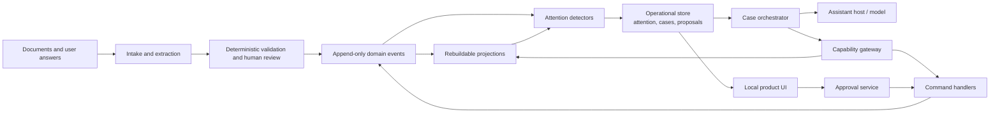
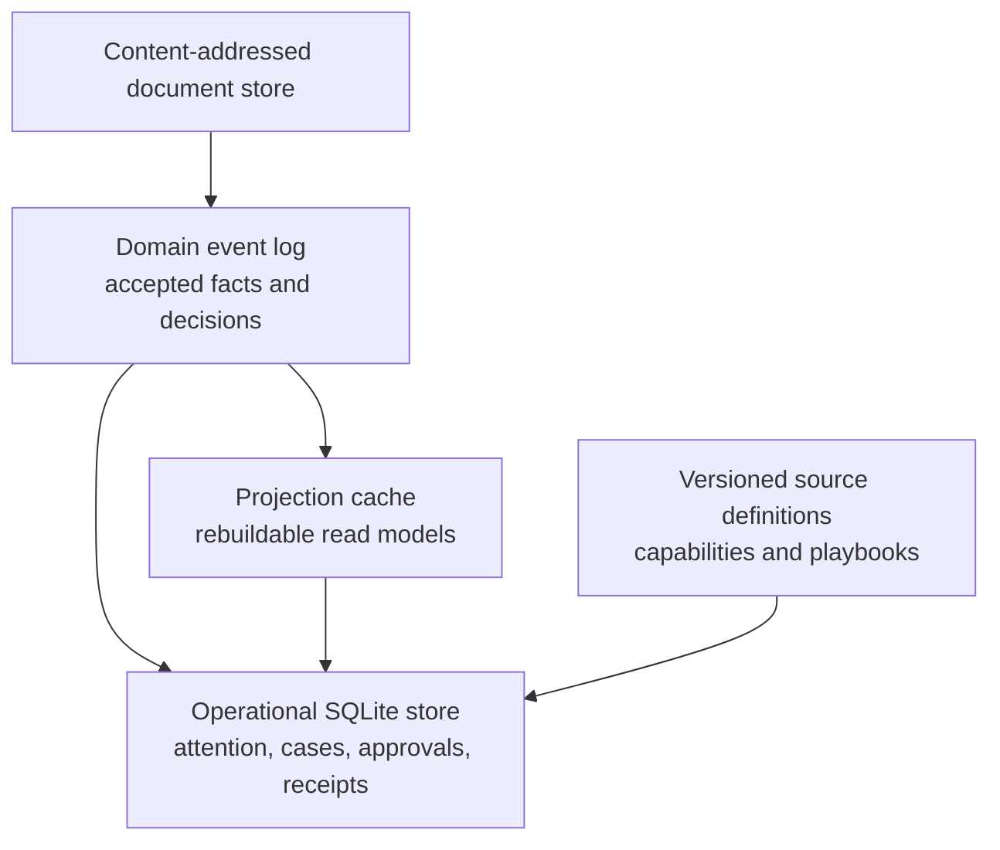
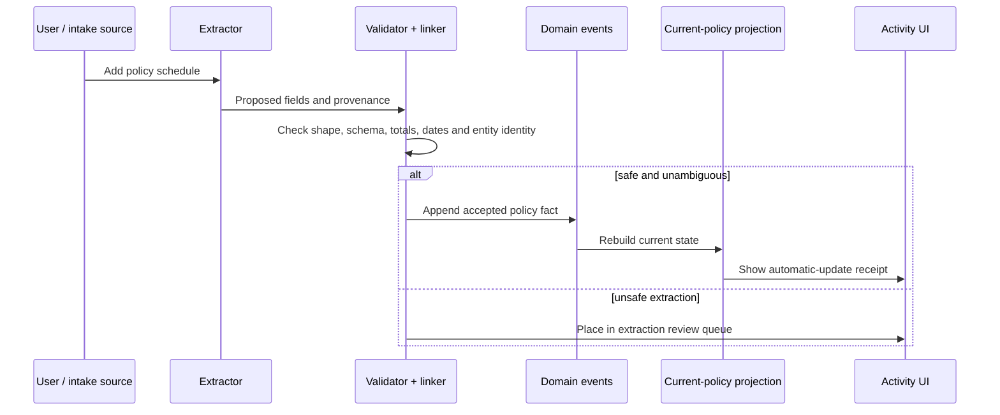
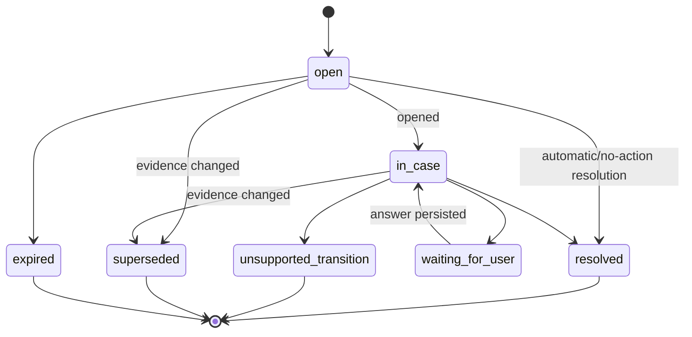
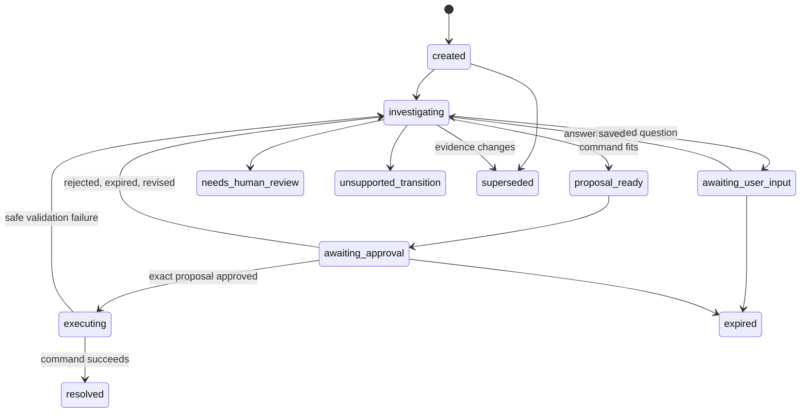
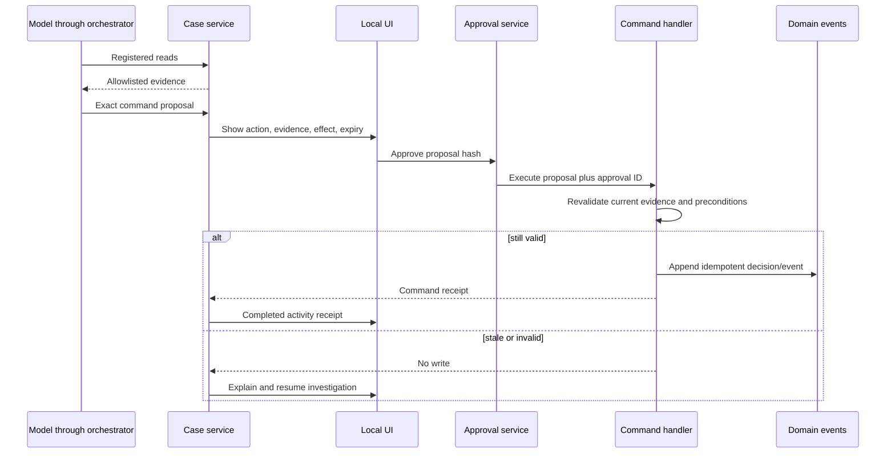

# Complete Case-System Architecture

## Purpose

This is the target architecture for Personal Records when it becomes a
proactive, bounded case system. It is a future implementation blueprint, not a
description of functionality already present in the repository.

The product rule is:

> Routine, sufficiently evidenced record updates happen automatically.
> Ambiguous or consequential situations become focused cases. A model can
> investigate and explain, but cannot gain authority beyond reviewed actions.

The existing content-addressed documents, extraction pipeline, deterministic
validation, human-review queue, typed domain events, projections, policy-wording
retrieval, and read-only MCP tools stay as the foundation. New components add
operational work around that foundation; they do not make a model the database
or the authority on durable state.

## Product behaviour

| Situation | Product response | Human involvement |
|---|---|---|
| A new schedule is confidently linked to an entity and has a normal later cover period | File the accepted fact and update the current-policy projection | None; show an activity receipt and correction route |
| Accepted evidence has a useful ambiguity, such as overlapping policies | Open an evidence-bound attention item and a focused case | Answer a small question or approve a bounded proposal |
| The next useful action has not been implemented and reviewed | Investigate using allowed reads, preserve findings, end safely | Take the next step outside the product |

A routine provider switch is in the first row. The user should not have to
approve a normal, unambiguous change from Provider A to Provider B. A case is
only necessary when the relationship is uncertain, information is missing, or a
new decision is required.

## System flow



The model is reached only through the case orchestrator. It has no direct
filesystem, database, event-log, or generic write capability.

## Components and responsibilities

| Component | Owns | Must not own |
|---|---|---|
| Intake and extraction | Document identity, proposed facts, provenance | Final acceptance or conversational writes |
| Validation and review | Deterministic safety rules and extraction confirmation | Agent orchestration |
| Domain event log | Accepted facts and domain decisions | Case progress or model reasoning |
| Projections | Rebuildable current policy, renewal and evidence views | Approval and workflow state |
| Attention service | Detection, evidence snapshot, lifecycle of operational work | Changing personal records |
| Capability register | Versioned definitions of authorised reads/commands | Runtime policy bypasses |
| Playbook registry | Policy for one recognised case type | Arbitrary code or tools |
| Case orchestrator | Bounded/resumable case state and model interaction | Authoritative execution |
| Capability gateway | Input/schema/scope checks and tool-call audit | Trusting model claims about preconditions |
| Command handler | Precondition checks, idempotency, event effects | Free-form chat interpretation |
| Approval service | Exact, expiring consent records | Inferred consent from a message |
| Product UI | Evidence, questions, approval and receipts | Direct writes to storage |

## Persistence architecture

The existing JSONL documents and immutable event history are a useful prototype
foundation. A complete local-first implementation needs transactional storage
for cases and commands. SQLite is the recommended default: it is embedded,
transactional, easy to back up, and can coexist with content-addressed source
files. A later sync implementation can replace this persistence adapter.



The operational store is distinct because an attention item is not a fact about
the outside world. A case resolution may append a domain event; asking a
question or closing stale work must not rewrite the history of policy facts.

### Operational records

| Record | Essential fields |
|---|---|
| `attention_item` | ID, kind, status, entity scope, rationale, risk, evidence snapshot/hash, detector/version, timestamps |
| `case` | ID, attention ID, playbook/version, state, permitted capability versions, evidence snapshot/hash, budget, expiry |
| `case_step` | Case ID, sequence, actor, kind, redacted payload/reference, timestamp |
| `proposal` | ID, command/version, canonical inputs/hash, evidence hash, effects, status, expiry |
| `approval` | Proposal ID/hash, approving identity, approval method, approved/revoked/expired time |
| `command_receipt` | Idempotency key, command/version, input hash, resulting event IDs, outcome |
| `detector_run` | Detector/version, source watermark, timing, result/failure count |

All operational rows need schema migrations, optimistic concurrency, encrypted
backup, retention rules, and a redaction policy for model-facing text.

## Normal automatic record path



`current_policies` should ultimately use explicit entity-linking and
date-aware-current-state rules—not merely import order. An accepted schedule
for the same vehicle with contiguous/later cover is the expected automatic
provider-switch path. A different provider is not inherently suspicious.

## Attention layer

Attention converts deterministic findings over accepted evidence, projections,
and review state into visible operational work. It does not itself authorise a
command.

| Detector | Deterministic trigger | Typical outcome |
|---|---|---|
| `pending_document_review` | Review record remains pending | Ask to confirm/reject extraction |
| `missing_current_wording` | Current policy lacks suitable wording | Ask for a document; no state change needed |
| `renewal_without_quote` | Reminder window reached with no linked quote | Reminder/comparison case |
| `ambiguous_policy_relationship` | Same entity is likely but dates/identity leave an unclear overlap or relationship | Ask smallest relationship question |
| `coverage_question_needs_wording` | No relevant clause for a user’s coverage question | Explain the evidence gap |

Detector functions are pure and versioned. Their item ID includes detector name
and version, entity scope, exact document IDs/versions, authoritative event IDs,
and relevant projected values. A corrected document generates a different
identity. The old item becomes `superseded`; it cannot authorise action against
new evidence.



## Capability register

The register is source-controlled, code-reviewed configuration backed by typed
server implementations. Startup and CI validate it. A model and product UI can
never publish a live capability.

```yaml
name: resolve_policy_relationship
version: 1
kind: command
risk: consequential
input_schema: ResolvePolicyRelationshipInput@v1
approval: explicit_bound_proposal
evidence_bindings:
  - existing_policy_doc_id
  - candidate_policy_doc_id
preconditions:
  - open_attention_matches_inputs
  - evidence_snapshot_is_current
  - policies_reference_same_entity
  - requested_relationship_is_allowed
idempotency_key: command_name + version + proposal_hash
effects:
  - append_policy_relationship_decision
audit_fields:
  - case_id
  - attention_id
  - proposal_hash
  - approval_id
```

| Category | Examples | Rule |
|---|---|---|
| Evidence reads | `get_record`, `get_provenance`, `compare_policy_periods`, `search_policy_wording` | Read-only and case-scoped where possible |
| Case interactions | `ask_clarification`, `record_user_answer`, `create_proposal` | Changes only operational state; playbook-validated |
| Domain commands | `resolve_policy_relationship`, `set_wording_association` | Server preconditions, idempotency, and approval as required |

There must be no assistant-facing `append_event`, `update_record`,
`execute_sql`, or `write_file` capability. Those are storage primitives, not
user-meaningful authority.

## Playbooks

A playbook is executable policy for a recognised case type. It narrows the
model’s reads, questions, commands, terminal states, and budgets. It leaves the
order of useful investigation and natural-language explanation flexible.

```yaml
name: ambiguous_policy_relationship
version: 1
trigger:
  attention_kind: ambiguous_policy_relationship
required_conditions:
  - attention_evidence_is_current
allowed_reads:
  - get_record@1
  - get_provenance@1
  - compare_policy_periods@1
allowed_interactions:
  - ask_clarification@1
  - create_proposal@1
allowed_commands:
  - resolve_policy_relationship@1
questions:
  - which_policy_relationship_applies
terminal_states:
  - resolved
  - needs_human_review
  - unsupported_transition
budgets:
  max_tool_calls: 8
  max_clarification_rounds: 2
  max_duration_hours: 168
```

The runtime validates each playbook against the register. It cannot reference a
missing capability, weaken a command’s approval/risk rule, or embed arbitrary
code. Its conditions reference named, tested deterministic predicates.

## Case orchestrator

The orchestrator is a state machine, not an autonomous background agent. Model
output is converted to a restricted action grammar:

```text
investigate(capability, arguments)
ask(question_id, wording)
propose(command, arguments, explanation)
finish(terminal_state, explanation)
```

It validates every action, executes only granted capabilities, stores a case
step, and returns only allowlisted results to the model. It rejects invalid
shapes, unsupported actions, cross-case identifiers, exhausted budgets, and
attempts to execute a write without approval.



Waiting is normal and durable. Restarting the app or assistant host resumes from
persisted state; it never reconstructs authority from a chat transcript.

## Proposal, approval, revalidation and execution

Consequential changes are two-stage.



The command transaction must atomically verify proposal hash/status/expiry and
approval, reload authoritative evidence, evaluate preconditions, claim the
idempotency key, append event(s) and receipt, and update case/attention state.
If any check fails, it writes no domain event. A retry returns the existing
receipt rather than repeating the effect.

## User experience surfaces

The local app is the canonical approval surface. A chat/MCP host may help with
investigation but cannot become the durable consent mechanism.

| Surface | Contents | Purpose |
|---|---|---|
| Home | Current records, upcoming dates, recent activity, attention count | Calm overview; automatic changes are visible without demanding work |
| Attention inbox | Reason, risk, entity, evidence age, status | Let the user select relevant work |
| Case view | Evidence summary, source links, explanation, focused question, permitted actions | Resolve one bounded situation |
| Approval sheet | Exact change, effects, evidence snapshot, expiry, approve/cancel | Collect unambiguous consent |
| Activity/audit | Automatic receipts, decisions, command outcome, evidence | Explain what happened and support correction |
| Settings | Notifications, model provider, backup/export | Keep local-first operation understandable |

Normal provider switches show an activity receipt. An uncertain overlap shows a
case. In either surface the system can answer what changed, why, which evidence
it used, and whether a person made the decision.

## APIs

The UI calls an authenticated local service and never writes event logs/files
directly.

| API family | Representative operations |
|---|---|
| Records | List current records, retrieve provenance, view activity |
| Attention | List/open/dismiss attention; retrieve rationale and evidence snapshot |
| Cases | Create/resume case, submit answer, retrieve timeline, cancel case |
| Proposals | Create/retrieve proposal, approve/reject it |
| Commands | Internal-only execution of an approved proposal and receipt lookup |
| Notifications | Schedule a local reminder from attention state only |

Keep the current seven MCP reads. Add case-scoped MCP tools only where user and
session identity are reliable:

```text
list_attention_items()
get_case(case_id)
investigate_case(case_id, registered_read, arguments)
ask_case_question(case_id, question_id, wording)
create_case_proposal(case_id, command, inputs, explanation)
```

There is deliberately no MCP approval or generic write tool. Approval happens
in the local product UI.

## Security, privacy and reliability

| Boundary | Enforcement |
|---|---|
| Model to records | Only case-scoped, allowlisted results; no filesystem/database access |
| Model to write | May request a proposal only; cannot execute command |
| Consent | One canonical proposal hash, person, expiry and effect summary |
| Command to state | Server preconditions, transactional idempotency, exact evidence binding |
| Stale evidence | Supersede/invalidate attention, cases and proposals after relevant change |
| Personal data | Local encryption/keychain where available, model-data minimisation, redacted diagnostics, export/delete controls |
| Recovery | Append-only facts, transactional operational records, projection rebuild, resumable cases |

A local scheduler runs detector jobs after accepted events and periodically for
time-based conditions. It can create attention and notify the user; it cannot
execute a consequential command. Notifications invite review without displaying
sensitive details on lock screens by default.

## Test strategy

| Layer | Essential tests |
|---|---|
| Detectors | Stable identity, no duplicates, correct supersession, fixture triggers |
| Projection/linking | Normal provider switch is automatic; ambiguous overlap does not silently overwrite state |
| Register/playbooks | Schema validation and no unregistered capability/path |
| Orchestrator | Scope/budget enforcement, durable resume, useful unsupported finish |
| Approval/commands | Tampering, expiry, stale evidence, cross-entity substitution, retry/idempotency, concurrency |
| UX | Evidence/consequences displayed before approval; cancellation and unsupported outcome clear |
| Model evaluation | Evidence-grounded explanations, concise questions, no invented authority |

Critical regressions: corrected evidence invalidates an old approval; a
predecessor document cannot substitute for a successor; two clients cannot
produce duplicate effects; a standard provider switch remains automatic; and an
ambiguous overlap opens a case rather than changing current state.

## Delivery sequence

1. Make entity linking and date-aware automatic current-policy semantics
   explicit; add automatic-update receipts.
2. Add SQLite operational persistence, migrations, attention items and read-only
   deterministic detectors.
3. Ship the attention inbox and case UI with no assistant writes.
4. Add the register and declarative playbook runtime, initially read-only and
   capable of `unsupported_transition`.
5. Add bounded, persisted assistant investigation and questions for one narrow
   playbook.
6. Add proposal creation and a local approval surface.
7. Implement exactly one idempotent command with full revalidation and
   end-to-end authority tests.
8. Expand only through observed, safely preserved unsupported cases and normal
   engineering/security review.

## Non-negotiable invariants

1. The model never writes domain events or records directly.
2. A capability is reviewed, versioned and server-enforced before it is live.
3. A playbook can narrow authority, never create it.
4. Attention is evidence-bound operational state, not permission.
5. Consequential writes require exact proposal, explicit approval and execution
   revalidation.
6. Retries produce one receipt and at most one intended effect.
7. Authoritative evidence changes invalidate stale cases and proposals.
8. `unsupported_transition` is a successful safe outcome.

This yields a system that is automatic where evidence is sufficient,
collaborative where a person must decide, and deliberately unable to exceed its
reviewed authority.
