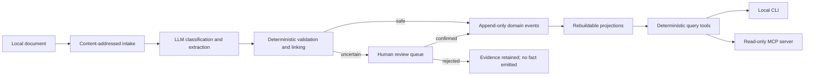
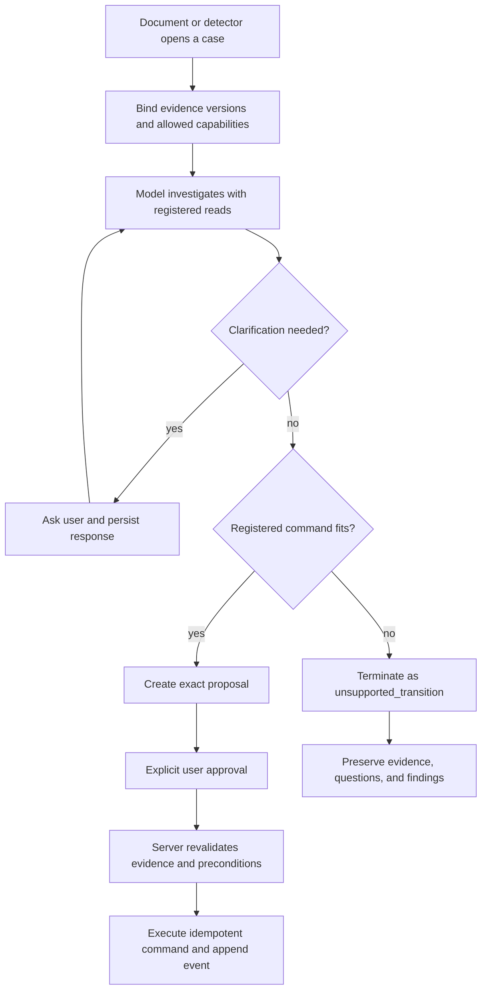

# Designing AI systems around evidence and authority

## Purpose

Personal Records is a local-first case study in using an AI model without making
the model the system of record. It accepts unstructured personal documents,
extracts proposed facts, validates them, records accepted outcomes, and exposes
evidence-backed answers through a CLI and a read-only MCP server.

The important design question is not simply where to call an LLM. It is where the
LLM's judgement should end.

The system follows one boundary throughout:

> Let AI interpret ambiguity and dynamically investigate; let deterministic
> software own facts, calculations, authority, and durable state transitions.

The current repository implements the evidence, extraction, validation, event,
projection, query, review, and read-only MCP layers. The Attention Layer,
Capability Register, Playbooks, and bounded case orchestration described later
are design extensions. They are included to show how the same authority boundary
could support more agentic behaviour without granting arbitrary write access.

## The motivating failure: valid output, invalid reality

The design began with a failure that ordinary structured-output checks did not
catch.

An insurance renewal invitation covered both motor and home products. The model
interpreted it as a single motor-policy quote and placed the bundle total in the
motor premium field. The value had correct provenance, high confidence, and a
schema-valid type. It was still wrong. Downstream code then calculated a false
62.7% renewal increase.

This was not a malformed JSON problem or a fabricated-number problem. It was a
domain-shape problem: the schema allowed a plausible but incorrect account of
what the document represented.

That distinction matters. Confidence answers “how certain was the extractor?”
and provenance answers “where did this value come from?” Neither proves that the
chosen domain model fits the document.

The resulting model makes several concepts explicit:

- A document may describe one or more product lines. A single policy is the
  one-line case, not the default assumption.
- A document-level stated total is structurally separate from each line's
  premium.
- A renewal proposal is different from a renewal already accepted.
- Classification has an `unsure` escape hatch instead of forcing every document
  into a known shape.
- Shape is checked before extracted facts can become accepted events.
- Ambiguous, conflicting, or structurally unsafe documents go to review and emit
  no facts automatically.

The synthetic MultiCover regression remains the executable statement of this
lesson: the document must reach review and must never silently become a renewal
event.

## Design principles

### AI output is a proposal

The model classifies documents, identifies their shape, extracts values, and may
interpret a natural-language question. Those results are proposals. They become
trusted application state only through deterministic routing rules or an
explicit human decision.

### Deterministic systems keep their existing strengths

An LLM is not used for arithmetic, date-band checks, event replay, entity-key
selection, filtering, or state mutation. Conventional code is more inspectable,
repeatable, and testable for these tasks.

### Evidence and state are different things

Documents are immutable evidence. Domain events record accepted facts and
decisions. Projections derive current views from those events. Removing a fact
does not delete its source document or rewrite history; a document-scoped
retraction changes how projections fold the log.

### Misfiled is worse than unextracted

An unknown or ambiguous document is visible and recoverable. A confident fact
attached to the wrong product, period, or entity can quietly corrupt every later
answer. The system therefore fails closed at structural and authority boundaries.

### Authority must be enforced by the application

A model saying “the user approved this” is not proof of approval. Consequential
changes require a registered command, exact evidence binding, deterministic
preconditions, idempotency, and an auditable decision. The application—not the
assistant—must enforce those requirements.

## Implemented architecture



The architecture is deliberately asymmetric. The model is used near the messy
edges—documents and language. The centre of the system is ordinary typed code.

| Layer | Owns | Does not own |
|---|---|---|
| Evidence store | Original content, content hash, metadata | Current business state |
| AI adapter | Classification, extraction, language interpretation | Persistence, calculations, approval |
| Validation and linking | Shape rules, confidence thresholds, cross-checks, entity resolution | Conversational judgement |
| Review | Explicit handling of ambiguous proposals | Silent overwrite |
| Event log | Accepted facts, decisions, retractions | Mutable current-state records |
| Projections | Current policies, renewals, comparisons, trust | New facts |
| Query layer | Deterministic reads and formatting | General-world speculation |
| MCP boundary | Allowlisted structured reads | Ingest, confirmation, rejection, discard, arbitrary writes |

### Evidence intake

Documents are identified by a SHA-256 content hash. Re-ingesting identical
content is idempotent and does not call the model again. User data lives outside
the repository under a configurable local data directory; repository examples
and evaluation fixtures are synthetic.

The document remains evidence even if its proposed extraction is rejected or its
previously accepted facts are later retracted. This preserves the distinction
between “the document exists” and “the system currently believes this fact.”

### Classification and extraction

The model is accessed through a small `LLMClient` port. Production uses the
Anthropic adapter; offline tests use a fake implementation. No domain module
depends directly on an SDK or API key.

Extraction produces typed values carrying:

- the proposed value;
- the extractor's confidence;
- an exact source snippet;
- a source page where available.

For quote-like documents, shape and document-level identifiers are extracted
separately from product lines. Non-canonical fields are discarded rather than
silently extending the domain schema at runtime.

### Deterministic validation and routing

Pure functions decide whether a proposed extraction may emit events. Checks
include:

- unknown or low-confidence document type;
- `unsure`, invalid, or multi-line shape;
- renewal already accepted rather than proposed;
- mismatch between declared and extracted line counts;
- sum of line premiums against the document's stated total;
- renewal premium outside a ±40% band from the relevant prior policy;
- missing required values or low-confidence fields;
- ambiguous entity links;
- a new policy schedule that would overwrite different current evidence.

An unsafe extraction returns review reasons and zero events. Validation never
partially accepts a document while also reporting it as unresolved.

The routing contract makes the authority boundary concrete:

```mermaid
sequenceDiagram
    participant L as LLM extractor
    participant V as Deterministic validator
    participant R as Human review
    participant E as Event log
    participant P as Projection

    L->>V: Proposed facts, confidence, and provenance
    V->>V: Check shape, required values, totals, dates, and entity link
    alt Safe and unambiguous
        V->>E: Append typed accepted event
        E->>P: Rebuild current view
    else Unsafe or incomplete
        V-->>R: Create review item with reasons
        Note over V,E: No event is emitted automatically
        alt User confirms
            R->>E: Append verified accepted event
            E->>P: Rebuild current view
        else User rejects
            R-->>R: Retain evidence; record no proposed fact
        end
    end
```

### Entity linking

Entity identity is separate from document identity. A document hash answers
“which evidence?” while an entity key answers “which policy or record?”

Linking uses deterministic precedence: exact identifiers first, then normalized
domain identifiers such as vehicle registration, then a new entity only where
the document type is allowed to establish one. Ambiguity is not resolved by a
best guess.

### Events, trust, and projections

Accepted results become typed events such as `PolicyFiled`, `RenewalProposed`,
`RenewalAccepted`, and `NcdConfirmed`. Human-confirmed extractions carry verified
trust; automatically accepted extractions carry extracted trust. Field-level
confidence and provenance remain attached to the values themselves.

Current policies, renewal calendars, quote comparisons, and provenance views are
projections over the event log. They can be rebuilt rather than repaired in
place. Premium changes are calculated deterministically from the paired current
policy and renewal evidence, and the result carries both document IDs.

A `DocumentDiscarded` event retracts facts supported by one document without
deleting evidence or affecting facts supported by another document for the same
entity.

### Policy-wording evidence

Policy wording is chunked and indexed locally. Retrieval is deterministic and
bounded. The MCP tool returns exact matched clauses with document, chunk,
section, heading, page, and score metadata; it returns evidence rather than a
coverage verdict.

When no wording or no relevant clause exists, the tool returns an explicit
failure result. The hosting assistant is instructed not to fill that gap from
general insurance knowledge. An interpreted answer must be grounded in the
returned clauses, and fabricated citations are rejected.

### Read-only assistant access

The MCP server exposes structured tools for current records, individual records,
renewals, quote comparison, missing information, provenance, and policy-wording
search. It performs no model call itself and cannot mutate records.

This is a security boundary, not merely a product limitation. A local assistant
may run as the user, but automatic tool selection is not evidence of user intent.
Read access can support investigation and explanation without granting the host
the ability to confirm an extraction, discard evidence, or append events.

## Why “add an agent” is not the architecture

The implemented system already provides the harder foundation an agent would
need: evidence, provenance, validation, events, projections, trust, and bounded
tools. Adding a general agent with arbitrary filesystem and mutation access would
weaken those properties rather than complete them.

The useful role for a conversational model is narrower:

- notice or present something that needs a decision;
- decide which registered reads would help investigate it;
- explain the relevant evidence;
- ask a concise clarification question;
- map the answer onto an allowed resolution;
- stop usefully when no authorised transition exists.

That role motivates the following design extensions.

## Design extension: Attention Layer

An Attention Layer sits between projections and user interfaces. It turns
evidence-backed gaps and candidate transitions into explicit operational work.
Examples include:

- a new schedule may replace or overlap the current policy;
- a current policy has no governing wording;
- an entity link is ambiguous;
- a renewal is approaching without a quote;
- a required document is awaiting review.

An attention item should carry at least:

```yaml
id: deterministic-content-derived-id
kind: possible_policy_replacement
entity_id: vehicle-or-policy-entity
evidence:
  - doc_id: current-policy-document
    version: immutable-content-version
  - doc_id: candidate-policy-document
    version: immutable-content-version
rationale: adjacent policy periods for the same vehicle
allowed_resolutions:
  - replace_current
  - keep_concurrent
  - relink_candidate
  - reject_candidate
risk: consequential
status: open
```

Detectors should be deterministic functions over evidence and projections. The
item identity must include every evidence version that contributed to the
conclusion, so a changed document or corrected authoritative fact produces a new
item rather than leaving a stale approval target.

Attention is operational state, not a fact about the outside world. Its lifecycle
belongs in a separate append-only store. A resolution that changes personal
records belongs in the domain event log.

## Design extension: Capability Register

A dynamic assistant needs to discover what it may do, but tool discovery alone
is insufficient. It also needs machine-readable authority constraints.

The Capability Register is a closed catalogue of reviewed reads and commands.
Each entry describes:

- name and version;
- read or command classification;
- input and output schema;
- deterministic preconditions;
- risk level;
- approval policy;
- exact evidence-binding requirements;
- idempotency identity;
- durable effects;
- possible failure outcomes;
- audit information to record.

For example:

```yaml
name: replace_current_policy
kind: command
inputs:
  attention_id: string
  current_policy_doc_id: sha256
  replacement_policy_doc_id: sha256
preconditions:
  - attention_item_is_open
  - evidence_versions_match
  - candidate_and_current_entities_match
  - periods_overlap_or_are_contiguous
risk: consequential
approval: explicit_and_bound_to_exact_inputs
idempotency: command_identity_hash
effect: append_policy_replacement_event
```

The register contains domain capabilities, not storage primitives. A command such
as `replace_current_policy` can enforce meaningful invariants. Generic operations
such as `update_record`, `append_event`, or `write_json` bypass the domain and
should not be exposed.

The model may choose among registered capabilities. It cannot create a new live
capability, weaken a precondition, or reinterpret a read capability as permission
to write.

## Design extension: Playbooks

Playbooks are the middle ground between a hard-coded workflow for every case and
an unconstrained agent loop. They describe how registered capabilities may be
combined for a recognised situation while leaving room for the model to adapt
the investigation and wording of questions.

```yaml
name: possible_policy_replacement
trigger:
  attention_kind: possible_policy_replacement
deterministic_conditions:
  - same_vehicle_entity
  - overlapping_or_adjacent_periods
read_capabilities:
  - get_record
  - get_provenance
  - compare_policy_periods
allowed_commands:
  - replace_current_policy
  - keep_concurrent_policies
  - relink_candidate_policy
questions:
  - confirm_relationship_between_policies
terminal_states:
  - resolved
  - needs_human_review
  - unsupported_transition
```

A Playbook limits the capabilities available within a case. The model can choose
which useful read to call next, omit redundant questions, and explain evidence in
natural language. Deterministic code evaluates conditions and command
preconditions.

A model may draft a candidate Playbook after encountering a repeated unsupported
case, but it cannot publish that draft into its own runtime. A developer must
review the domain transition, implement any new command or event, and add
evaluation cases before the Playbook becomes executable.

## Design extension: a bounded, resumable case loop

The Attention Layer, Capability Register, and Playbooks combine into a small case
orchestrator:



The case persists model decisions, tool results, clarification questions,
approvals, and command outcomes. Calls and retries are bounded. A pause for human
input is a normal state, not a failed model invocation.

Unknown situations remain useful but read-only. The assistant may inspect related
records, explain its evidence-backed hypothesis, and ask questions. If no
registered command fits, `unsupported_transition` is the successful safe outcome.
The model must not invent an event because the conversation feels conclusive.

## Propose, approve, revalidate, execute

Consequential conversational writes require more than a chat message containing
“yes.” A safe interaction is:

1. The assistant investigates using read capabilities.
2. It creates a proposal containing the exact command, arguments, evidence
   versions, and consequences.
3. The user sees and explicitly approves that proposal.
4. The server checks that the proposal and evidence are unchanged and unexpired.
5. The command handler reruns authoritative preconditions.
6. An idempotent command executes once.
7. The decision and resulting event are recorded for audit and replay.

This prevents retries, concurrent clients, corrected evidence, or ambiguous
conversation from turning one user decision into a different state change.

## Authority invariants learned from design review

Three failure classes deserve explicit tests in any implementation of the
extensions:

### Stale attention must not authorize current state

If a policy is corrected after an attention item is opened, the old item cannot
approve a command against the corrected facts. Item identity and command
validation must bind to all authoritative evidence versions and relevant values.

### Replay validates authority, not just internal consistency

An event can be internally well-formed while contradicting authoritative policy
facts. Replay and recovery must verify registered event semantics against the
evidence and relationships they claim to represent; a valid hash or matching
fields inside the event are not enough.

### Similar evidence is not identical evidence

A predecessor policy for the same entity and period must not satisfy a successor
policy's missing-evidence condition. Detectors and resolutions must bind to the
exact policy document and version, not merely a compatible entity, provider, or
date range.

These are examples of a broader rule: authority is a relationship between an
approved operation and exact current evidence, not a confidence score attached
to a model output.

## Evaluation strategy

AI systems need more than prompt examples and schema tests. Evaluation should be
layered around the responsibilities in the architecture:

- **Classification:** Did the model identify the document type or safely return
  unknown?
- **Extraction:** Do proposed values match synthetic ground truth and retain
  provenance?
- **Shape:** Did the model represent the number of product lines and document
  status correctly?
- **Routing:** Did deterministic rules accept, store, or review the document for
  the expected reasons?
- **Projection:** Does replay rebuild the same current state after correction and
  retraction?
- **Retrieval:** Are returned clauses relevant, bounded, and exactly cited?
- **Authority:** Can stale, replayed, retried, or cross-entity commands change
  state?
- **Unknown-case behaviour:** Can an assistant remain useful while terminating
  without an unregistered write?

The repository's synthetic fixtures allow offline deterministic tests and a
separate live-model evaluation without placing real personal data in source
control.

## Privacy and trust boundary

Local-first storage reduces the number of systems holding sensitive documents,
but it does not remove the need for explicit data-flow boundaries.

- Documents and derived state remain in the user's local data directory.
- Only commands that require classification, extraction, or interpretation send
  document text to the configured model provider.
- The MCP server makes no extraction-model call and exposes allowlisted data.
- Raw documents and local storage paths are not returned through MCP.
- External assistants receive no generic filesystem or record-mutation tool.
- Repository fixtures are synthetic; real documents and credentials do not
  belong in the repository or its history.

Local execution is therefore one control among several. Provenance, least
authority, explicit approval, and fail-closed retrieval remain necessary.

## Extensions and open questions

The design suggests several questions worth exploring without treating them as
delivery commitments:

- Can a model investigate a genuinely unseen case usefully while having no path
  to an unregistered write?
- Which attention conditions must be purely deterministic, and where is a
  model-generated, non-authoritative suggestion useful?
- Can Playbooks remain declarative without becoming another general-purpose
  programming language?
- What is the smallest approval protocol that binds natural-language consent to
  exact consequences across different MCP hosts?
- How should long-running cases expire, resume, and reconcile concurrent changes?
- When repeated `unsupported_transition` cases occur, what evidence is sufficient
  to justify a new domain command?
- How do the same patterns transfer to financial records, healthcare documents,
  compliance evidence, or operational workflows?

## Conclusion

The distinctive engineering challenge in an AI system is not that every layer
should become probabilistic. It is that probabilistic interpretation must be
connected to deterministic authority without disguising one as the other.

Personal Records uses the model where conventional software is weakest: reading
messy documents and understanding human questions. It uses conventional software
where it remains strongest: invariants, calculations, identities, persistence,
permissions, replay, and audit.

The proposed Attention Layer, Capability Register, Playbooks, and bounded case
loop extend that separation rather than replacing it. They allow the model to be
dynamic about investigation and conversation while keeping durable state changes
closed, explicit, testable, and accountable.
